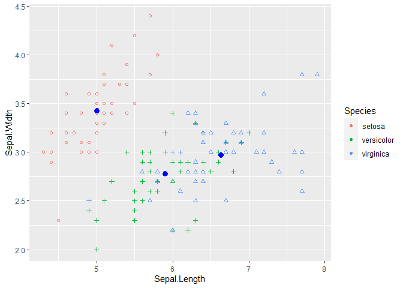
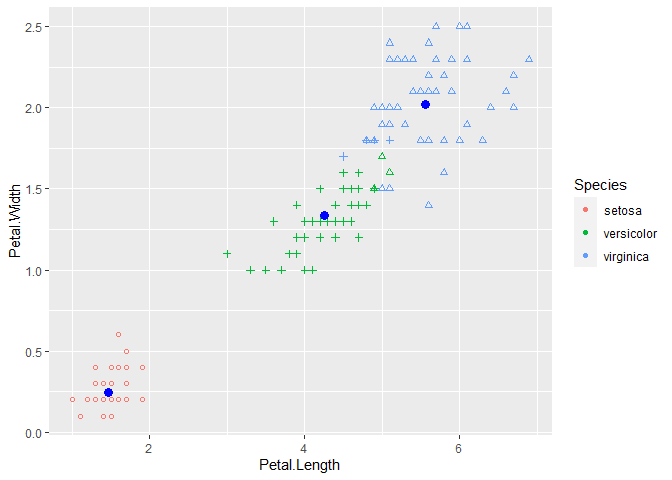

<!-- README.md is generated from README.Rmd. Please edit that file -->

# KNN, Hierarchical, and EM Clustering Implementations in R

This package was completed as part of STAT 431 Advanced Programming in R
at Cal Poly

``` r
library(clust431)
library(dplyr)
#> 
#> Attaching package: 'dplyr'
#> The following objects are masked from 'package:stats':
#> 
#>     filter, lag
#> The following objects are masked from 'package:base':
#> 
#>     intersect, setdiff, setequal, union
library(ggplot2)
```

### K Nearest Neighbors

First the classic of example of predicting iris species using the petal
and sepal lengths. We also compute the proportion of variation explained
by the grouping. Each one of my implementations is compared to the base
R equivalent.

``` r
kmodel <- kmeans(iris[,1:4], 3)
kmodel$betweenss / kmodel$totss
#> [1] 0.8842753
table(iris$Species, kmodel$cluster)
#>             
#>               1  2  3
#>   setosa      0 50  0
#>   versicolor 48  0  2
#>   virginica  14  0 36

mymodel <- k_means(iris[,1:4], 3)
mymodel$ssbetween / mymodel$sstotal
#> [1] 0.7895522
table(iris$Species, mymodel$assign)
#>             
#>               1  2  3
#>   setosa     21 29  0
#>   versicolor  3  0 47
#>   virginica   0  0 50
```

Now to predict the number of cylinders in a car using othe rmetrics
(mtcars). This time we will use the first two principle components
instead of the original variables.

``` r
mttrain <- mtcars %>%
  select(mpg, disp, hp, drat, wt, qsec)

mtcarspc <- data.frame((princomp(mttrain)$scores[,1:2]))

kmodel <- kmeans(mtcarspc, 3)
kmodel$betweenss / kmodel$totss
#> [1] 0.8539862
table(mtcars$cyl, kmodel$cluster)
#>    
#>      1  2  3
#>   4  0  0 11
#>   6  2  0  5
#>   8  5  9  0

mymodel <- k_means(mttrain, 3, T)
mymodel$ssbetween / mymodel$sstotal
#> [1] 0.8087915
table(mtcars$cyl, mymodel$assign)
#>    
#>      1  2  3
#>   4  0  0 11
#>   6  7  0  0
#>   8  0 14  0
```

### Hierarchical Clustering

``` r
mydata <- iris[,1:4]
groupstrs <- hier_clust(mydata, 3)
print(groupstrs)
#> [1] "16, 15, 34, 33, 19, 6, 17, 49, 11, 47, 22, 20, 45, 37, 32, 21, 44, 27, 24, 36, 50, 40, 8, 18, 1, 29, 28, 41, 38, 5, 25, 12, 31, 30, 26, 35, 10, 13, 46, 2, 7, 3, 48, 4, 42, 23, 14, 43, 39, 9"                                                                                                                                                                                                   
#> [2] "61, 99, 94, 58, 107, 85, 67, 91, 56, 89, 97, 96, 100, 95, 68, 93, 83, 74, 79, 92, 64, 62, 72, 98, 75, 63, 80, 65, 60, 90, 54, 70, 82, 81, 76, 66, 59, 55, 77, 87, 53, 51, 86, 57, 52, 88, 69, 120, 147, 127, 124, 73, 134, 84, 150, 71, 139, 128, 115, 122, 114, 143, 102, 78, 148, 111, 105, 133, 129, 112, 104, 138, 117, 116, 149, 137, 125, 144, 121, 145, 141, 140, 113, 146, 142, 135, 109"
#> [3] "101, 119, 123, 106, 136, 131, 108, 103, 130, 126, 110, 132, 118"
```

### EM Algorithm

``` r
dat <- iris[,1:4]

iris_clust <- em_clust(dat, 3)
```

``` r

table(iris_clust$group, iris$Species)
#>    
#>     setosa versicolor virginica
#>   1      0         50        50
#>   2     14          0         0
#>   3     36          0         0
```

``` r
plotone <- ggplot(data = iris, aes(Sepal.Length, Sepal.Width, colour = Species)) + 
    geom_point(shape = iris_clust$group) + 
    geom_point(data = iris_clust$mu, aes(iris_clust$mu[,1], iris_clust$mu[,2]), color = "blue", size = 3)

plottwo <- ggplot(data = iris, aes(Petal.Length, Petal.Width, colour = Species)) + 
    geom_point(shape = iris_clust$group) + 
    geom_point(data = iris_clust$mu, aes(iris_clust$mu[,3], iris_clust$mu[,4]), color = "blue", size = 3)
    
plotone
```



``` r
plottwo
```


